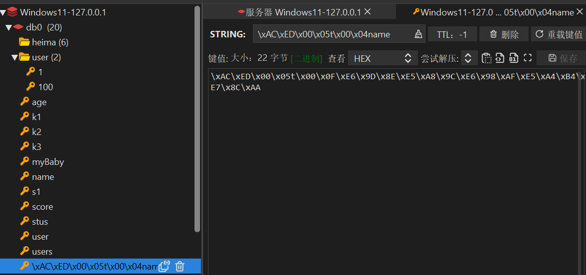
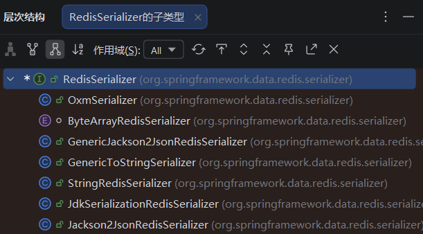
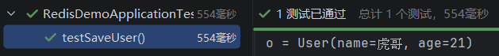
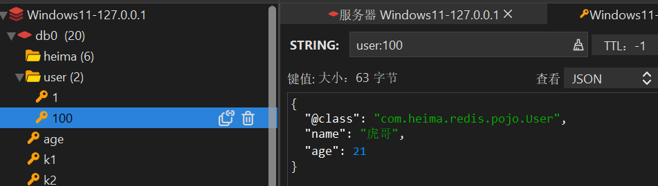
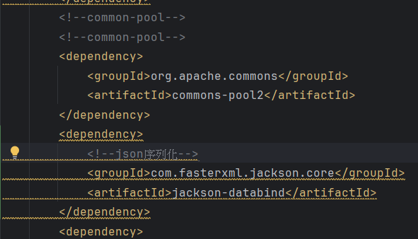
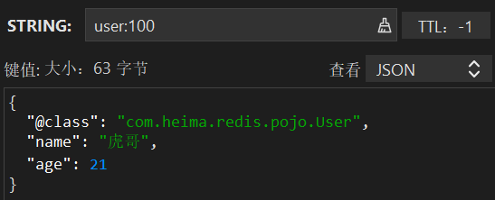

# 基础篇

## 一、初识Redis

### 1、认识NoSQL

|   差别   |                             SQL                              |                            NoSQL                             |
| :------: | :----------------------------------------------------------: | :----------------------------------------------------------: |
| 数据结构 |                     结构化（Structured）                     |                           非结构化                           |
| 数据关联 |                     关联的（Relational）                     |                           无关联的                           |
| 查询方式 |                           SQL查询                            |                            非SQL                             |
| 事务特性 |                             ACID                             |                             BASE                             |
| 存储方式 |                             磁盘                             |                             内存                             |
|  扩展性  |                             垂直                             |                             水平                             |
| 使用场景 | （1）数据结构稳定<br>（2）相关业务对数据安全性、一致性要求较高 | （1）数据结构不固定<br/>（2）对一致性、安全性要求不高<br/>（3）对性能要求 |

- **ACID vs BASE**

ACID（强一致性，关系型数据库）

**全称**：原子性 (Atomicity)、一致性 (Consistency)、隔离性 (Isolation)、持久性 (Durability)

**核心**：宁可慢，不能错 ✅

| 特性       | 通俗解释                                                     |
| ---------- | ------------------------------------------------------------ |
| 原子性 (A) | 事务要么全部成功，要么全部失败（转账：扣钱 + 加钱必须同生共死） |
| 一致性 (C) | 事务前后数据状态合法（转账前后总金额不变）                   |
| 隔离性 (I) | 多个事务并发时，互相看不见中间状态（避免脏读 / 幻读）        |
| 持久性 (D) | 事务提交后，数据永久保存，断电也不丢                         |

BASE（最终一致性，分布式 / NoSQL）

**全称**：基本可用 (Basically Available)、软状态 (Soft state)、最终一致性 (Eventually consistent)

**核心**：先跑起来，账慢慢对 ⚡

| 特性           | 通俗解释                                                   |
| -------------- | ---------------------------------------------------------- |
| 基本可用 (BA)  | 系统部分故障时，仍能提供核心服务（不整体宕机）             |
| 软状态 (S)     | 允许数据存在中间过渡状态（暂时不一致）                     |
| 最终一致性 (E) | 经过一段时间后，数据会自动同步到一致状态（不要求实时一致） |

### 2、认识Redis

Redis诞生于2009年，全称是Remote Dictionary Server，远程词典服务器，是一个基于内存的键值型NoSQL数据库。

**特征：**

- 键值（Key-value）型，value支持多种不同的数据结构，功能丰富
- 单线程，每个命令具备原子性
- 低延迟，速度快（基于内存、IO多路复用、良好的编码）
- 支持数据持久化
- 支持主从集群、分片集群
- 支持多语言客户端

### 3、Windows版Redis安装

Redis 官方不提供 Windows 安装包，但 Microsoft 维护了 Windows 移植版，也可使用 Memurai 或 WSL2 方案。

**方式一：Microsoft 移植版（推荐，简单）**

1. 访问 GitHub Release 页面：`https://github.com/microsoftarchive/redis/releases`
2. 下载最新 `.msi` 安装包（如 `Redis-x64-3.0.504.msi`）
3. 双击安装，勾选"添加环境变量"，一路 Next 即可
4. 安装后 Redis 默认作为 Windows 服务开机自启

**方式二：Memurai（更活跃的维护版）**

1. 官网 `https://www.memurai.com/` 下载安装包
2. 免费开发版功能与 Redis 5.x 兼容，安装步骤与方式一相同

**方式三：WSL2（最接近生产环境）**

1. 启用 WSL2 并安装 Linux 发行版（如 Ubuntu）

2. 在 WSL 终端中执行：

   ```bash
   sudo apt update && sudo apt install redis-server -y
   sudo service redis-server start
   ```

**验证安装**

```bash
redis-cli ping
# 返回 PONG 即表示安装成功
```

**常用命令**

| 命令                        | 说明              |
| --------------------------- | ----------------- |
| `redis-server`              | 前台启动 Redis    |
| `redis-cli`                 | 进入 Redis 命令行 |
| `redis-cli shutdown`        | 停止 Redis 服务   |
| `redis-cli -h 主机 -p 端口` | 连接远程 Redis    |

> ⚠ **注意**：Microsoft 移植版停留在 3.0 版本，较旧，部分新特性不支持。学习和本地开发够用，生产环境建议用 Linux。


### 4、Redis命令行客户端

基础命令

```shell
PS C:\Users\BangeLu> redis-cli -h 127.0.0.1 -p 6379
127.0.0.1:6379> ping
PONG#测试成功
127.0.0.1:6379> set key value [expiration EX seconds|PX milliseconds] [NX|XX]
PS C:\Users\BangeLu> redis-cli -h 127.0.0.1 -p 6379#连接本地Redis，指定端口为默认端口6379
127.0.0.1:6379> set name ikun
OK
127.0.0.1:6379> set age 22
OK
127.0.0.1:6379> get name
"ikun"
127.0.0.1:6379> get age
"22"
```


### 5、图形化桌面客户端

**Redis Desktop Manager（Windows 版）**

GitHub 地址：`https://github.com/lework/RedisDesktopManager-Windows`

1. 访问上述 GitHub 仓库，在 Releases 页面下载最新 `.exe` 安装包
2. 双击安装，一路 Next 即可
3. 启动后，点击「连接到 Redis 服务器」：
   - 地址：`127.0.0.1`（本机）
   - 端口：`6379`（默认）
   - 名称：自定义（如"本地"）
4. 连接成功后，左侧即可浏览所有 Key，支持查看/编辑/删除等操作

> 💡 **说明**：官方 Redis Desktop Manager 从 2019 年起开始收费，lework 维护的这个是免费的社区 Windows 编译版，功能和官方版基本一致。


## 二、Redis常见命令

### 1、Redis数据结构介绍

Redis是一个key-value的数据库，key一般是String类型，不过value的类型多种多样：

|    类型     |           例子            |
| :---------: | :-----------------------: |
|  `String`   |       `hello world`       |
|   `Hash`    | `{name: "Jack", age: 21}` |
|   `List`    |   `[A -> B -> C -> C]`    |
|    `Set`    |        `{A, B, C}`        |
| `SortedSet` |   `{A: 1, B: 2, C: 3}`    |
|    `GEO`    |   `{A: (120.3, 30.5)}`    |
|  `BitMap`   |   `0110110101110101011`   |
| `HyperLog`  |   `0110110101110101011`   |

其中，String、Hash、List、Set、SortedSet基本类型

### 2、Redis通用命令

通用指令是部分数据类型的，都可以使用的指令，常见的有：

- KEYS：查看符合模板的左右key，不建议在生产环境设备上使用
- DEL：删除一个指定的key
- EXISTS：判断key是否存在
- EXPIRE：给一个key设置有效期，有效期到期时该key会被自动删除
- TTL：查看一个key的剩余有效期（-1永久有效，）

### 3、String类型

String类型，也就是字符串类型，是Redis中最简单的类型。

其value是字符串，不过根据字符串的格式不同，又可以分为三类：

- string：普通字符串
- int：整数类型，可以做自增、自减操作
- float：浮点类型，可以做自增、自减操作

不管是哪种形式，底层都是字节数组形式存储，只不过是编码方式不同，字符串类型的最大空间不能超过**512m**。


**String类型的常见命令**：

- SET：添加或者修改已经存在的一个String类型的键值对
- GET： 根据key获取String类型的value
- MSET：批量添加多个String类型的键值对
- MGET：根据多个key获取多个String类型的value
- INCR：让一个整型的key自增1
- INCRBY：让一个整型的key自增并指定步长，例如：`incrby num 2`，让num值自增2
- INCRBYFLOAT：让一个浮点类型的数字自增并指定步长
- SETNX：添加一个String类型的键值对，前提是这个key不存在，否则不执行
- SETEX：添加一个String类型的键值对，并且制定有效期


### 4、key的层级格式

**key的结构**

Redis的key允许有多个单词形成层级结构，多个单词之间用' : '隔开，格式如下：

​												`项目名：业务名：类型：id`

这个格式并不是固定的，也可以根据实际需求来删除或者添加词条。

例如我学的这个项目就叫做heima，有user和product两种不同类型的数据，我就可以这样来定义key：

- user相关的key：`heima:user:1`

- product相关的key：`heima:product:1`

如果Value是一个Java对象，例如一个User独享，则可以将对象序列化为JSON字符串后存储：

|       KEY       |                      VALUE                      |
| :-------------: | :---------------------------------------------: |
|  heima:user:1   |      {"id": 1, "name": "Jack", "age": 21}       |
| heima:product:1 | {"id": 1, "name": "VivoX100pro", "price": 5699} |

在终端连接Redis，输入以下命令：

```shell
127.0.0.1:6379> set heima:user:1 '{"id":1, "name":"Jack", "age": 21}'
OK
127.0.0.1:6379> set heima:user:2 '{"id":2, "name":"Rose", "age": 18}'
OK
127.0.0.1:6379> set heima:product:1 '{"id":1, "name":VivoX100pro", "price": 5699}'
OK
127.0.0.1:6379> set heima:product:2 '{"id":2, "name":"Honor6", "price": 2999}'
OK
```

然后打开RESP，刷新数据库，会发现会多出一个文件夹“heima”：


在可视化界面，分层结构就非常直观了。


### 5、Hash类型

Hash类型，也叫散列，其value是一个无序字典，类似于Java中的HashMap结构。

String结构是将对象序列化为JSON字符串后存储，当需要修改对象某个字段时很不方便：

|       KEY       |                      VALUE                      |
| :-------------: | :---------------------------------------------: |
|  heima:user:1   |      {"id": 1, "name": "Jack", "age": 21}       |
| heima:product:1 | {"id": 1, "name": "VivoX100pro", "price": 5699} |

修改要么覆盖，要么字符串删除重新写。

Hash结构可以将对象中的每个字段独立存储，可以针对单个字段做CRUD：

| key       | field  | value    | 可单独操作          |
| --------- | ------ | -------- | ------------------- |
| user:1001 | id     | 1001     | 查 / 改 / 删 id     |
| user:1001 | name   | ZhangSan | 查 / 改 / 删 name   |
| user:1001 | age    | 22       | 查 / 改 / 删 age    |
| user:1001 | gender | male     | 查 / 改 / 删 gender |

**Hash类型常见的命令：**

- HSET key field value：设置哈希的单个字段
- HGET key field：获取单个字段的值
- HMSET key field1 value1 field2 value2…：批量设置多个字段
- HMGET key field1 field2…：批量获取多个字段
- HGETALL key：获取哈希所有字段和值
- HEXISTS key field：判断字段是否存在
- HDEL key field：删除指定字段
- HLEN key：获取哈希字段数量
- HKEYS key：获取所有字段名
- HVALS key：获取所有字段值
- HINCRBY key field increment：字段整数值自增
- HINCRBYFLOAT key field increment：字段浮点数值自增

- HSETNX key field value： 仅当 field 不存在 时，才设置该字段的值；  如果字段已存在，则不执行任何操作，返回 0


### 6、List类型

Redis中的List类型与Java中的LinkedList类似，可以看做是一个双向链表结构。既可以支持正向检索也可以支持反向检索。

特征也与LinkedList类似：

- 有序
- 元素可以重复
- 插入和删除快
- 查询速度一般

常用来存储一个有序数据，例如：朋友圈点赞列表，评论列表等。

**List类型的常见命令：**

- LPUSH key element ...：想列表左侧插入一个或多个元素
- LPOP key：移除并返回列表左侧的第一个元素，没有则返回nil
- RPUSH key element ... ：向列表右侧插入一个或多个元素
- RPOP key：移除并返回列表右侧的第一个元素
- LRANGE key star end：返回一段角标范围内的所有元素
- BLPOP和BRPOP：与LPOP和RPOP类似，只不过在没有元素使等待指定时间，而不是直接返回nil


### 7、Set类型

Redis的Set结构与Java中的HashSet类似，可以看做是一个value为null的HashMap。因为也是一个hash表，因此具备与HashSet类似的特征：

- 无序
- 元素不可重复
- 查找快
- 支持交集、并集、差集等功能
- Set类型的常见

**Set类型的常见命令：**

- SADD key member ... ：向set中添加一个或多个元素
- SREM key member ... ：移除set中的指定元素
- SCARD key：返回set中的元素的个数
- SISMEMBER：key member：判断一个元素是否存在于set中
- SMEMBERS：获取set中的所有元素
- SINTER key1 key2 ... ：求key1与key2 的交集
- SDIFF key1 key2 ... ：求key1与key2的差集
- SUNION key1 key2 ... :求key1和key2的并集


### 8、SortedSet类型

Redis的SortedSet是一个可排序的set集合，与Java中的TreeSet有些类似，但底层数据结构却差别很大。SortedSet中的每个元素都带有一个score属性，可以基于score属性对元素排序，底层的视线是一个跳表）（SkipList）加hash表。SortedSet具备下列特性：

- 可排序
- 元素不重复
- 查询速度快

因为SortedSet的可排序特性，经常被用来实现排行榜这样的功能。

**SortedSet类型的常见命令：**

- ZADD key score member：添加一个或多个元素到sorted set，如果已经存在则更新其score值
- ZREM key member：删除sorted set中的一个指定元素
- ZSCORE key member：获取sorted set中的指定元素的score值
- ZRANK key member：获取sorted set中的指定元素的排名（默认排名从0开始）
- ZCARD key：获取sorted set中的元素个数
- ZCOUNT key min max：统计score值在给定范围内的所有元素个数
- ZINCRBY key increment member：让sorted set中的指定元素自增，步长为指定的increment值、
- ZRANGE key min max：按照score排序后，获取指定排名范围内的元素
- ZRANGEBYSCORE key min max：按照score排序后，获取指定score范围内的元素
- ZDIFF、ZINTER、ZUNION：求差集、交集、并集

注意：所有的排名默认都是升序，如果要降序则在命令的Z后面添加REV即可

**案例：SortedSet 命令练习**

将班级的下列学生得分存入 Redis 的 SortedSet 中：

**并实现下列功能：**

1. 删除 Tom 同学
2. 获取 Amy 同学的分数
3. 获取 Rose 同学的排名
4. 查询 80 分以下有几个学生
5. 给 Amy 同学加 2 分
6. 查出成绩前 3 名的同学
7. 查出成绩 80 分以下的所有同学

```bash
127.0.0.1:6379> zadd stus 85 Jack 89 Lucy 82 Rose 95 Tom 78 Jerry 92 Amy 76 Miles
(integer) 7
127.0.0.1:6379> zrem stus Tom
(integer) 1
127.0.0.1:6379> zscore stus Amy
"92"
127.0.0.1:6379> zrank stus Rose
(integer) 2
127.0.0.1:6379> zrank stus Rose
(integer) 2
127.0.0.1:6379> zrevrank stus Rose
(integer) 3
127.0.0.1:6379> zcount stus 0 80
(integer) 2
127.0.0.1:6379> zincrby stus 2 Amy
"94"
127.0.0.1:6379> zrevrange stus 0 2
1) "Amy"
2) "Lucy"
3) "Jack"
127.0.0.1:6379> zrangebyscore stus 0 80
1) "Miles"
2) "Jerry"
```


## 三、Redis的Java客户端

### 1、客户端对比

#### （1）Jedis

Jedis 是 Redis 官方推荐的 Java 客户端，API 与 Redis 原生命令高度一致。

**引入依赖**：

```xml
<dependency>
    <groupId>redis.clients</groupId>
    <artifactId>jedis</artifactId>
    <version>4.3.0</version>
</dependency>
```

**基本使用**：

```java
// 1. 创建连接
Jedis jedis = new Jedis("127.0.0.1", 6379);

// 2. 执行命令（方法与 Redis 命令一一对应）
jedis.set("name", "ikun");
String name = jedis.get("name");
jedis.hset("user:1", "age", "22");
jedis.close();
```

**连接池**（线程安全，复用连接）：

```java
JedisPool pool = new JedisPool("127.0.0.1", 6379);
try (Jedis jedis = pool.getResource()) {
    jedis.set("key", "value");
}
```

#### （2）Spring Data Redis

Spring 生态下的 Redis 客户端，底层可切换 Jedis 或 Lettuce，提供 RedisTemplate 封装。

**引入依赖**：

```xml
<dependency>
    <groupId>org.springframework.boot</groupId>
    <artifactId>spring-boot-starter-data-redis</artifactId>
</dependency>
```

**配置**（application.yml）：

```yaml
spring:
  data:
    redis:
      host: 127.0.0.1
      port: 6379
```

**RedisTemplate**：

```java
@Autowired
private RedisTemplate<String, Object> redisTemplate;

// 操作各种类型
redisTemplate.opsForValue().set("name", "ikun");          // String
redisTemplate.opsForHash().put("user:1", "age", 22);     // Hash
redisTemplate.opsForList().leftPush("list", "a");         // List
redisTemplate.opsForSet().add("set", "a", "b");           // Set
redisTemplate.opsForZSet().add("rank", "Amy", 92);       // SortedSet
```

**序列化**：默认使用 JDK 序列化（可读性差），建议改为 JSON 序列化：

```java
// 用 Spring 提供的 StringRedisTemplate（key 和 value 都是 String）
@Autowired
private StringRedisTemplate stringRedisTemplate;

// 或自定义序列化器
redisTemplate.setKeySerializer(new StringRedisSerializer());
redisTemplate.setValueSerializer(new GenericJackson2JsonRedisSerializer());
```

#### （3）Jedis vs Lettuce vs Redisson

| 客户端       | 特点                                                         | 适合场景           |
| ------------ | ------------------------------------------------------------ | ------------------ |
| **Jedis**    | 同步阻塞，API 简单直白，与 Redis 命令一一对应                | 简单项目、入门学习 |
| **Lettuce**  | 基于 Netty，异步非阻塞，线程安全，Spring Boot 2.x 默认       | 高并发项目         |
| **Redisson** | 分布式锁、分布式集合等高级封装，基于 Netty                   | 分布式场景         |

> 💡 Spring Boot 2.x 起默认使用 Lettuce，无需额外引入依赖，直接用 spring-boot-starter-data-redis 即可。


### 2、Jedis快速入门

Jedis的官网地址：[redis/jedis: Redis Java client](https://github.com/redis/jedis)

如何使用呢？

#### （1）引入依赖

```xml
<dependency>
    <groupId>redis.clients</groupId>
    <artifactId>jedis</artifactId>
    <version>7.1.0</version>
</dependency>
```

最终Maven的xml配置文件应该是：

```xml
<?xml version="1.0" encoding="UTF-8"?>
<project xmlns="http://maven.apache.org/POM/4.0.0"
         xmlns:xsi="http://www.w3.org/2001/XMLSchema-instance"
         xsi:schemaLocation="http://maven.apache.org/POM/4.0.0 http://maven.apache.org/xsd/maven-4.0.0.xsd">
    <modelVersion>4.0.0</modelVersion>

    <groupId>com.heima</groupId>
    <artifactId>jedis-demo</artifactId>
    <version>1.0-SNAPSHOT</version>

    <properties>
        <maven.compiler.source>8</maven.compiler.source>
        <maven.compiler.target>8</maven.compiler.target>
        <project.build.sourceEncoding>UTF-8</project.build.sourceEncoding>
    </properties>
    <dependencies>
        <!--jedis-->
        <dependency>
            <groupId>redis.clients</groupId>
            <artifactId>jedis</artifactId>
            <version>7.1.0</version>
        </dependency>
        <!--单元测试-->
        <dependency>
            <groupId>org.junit.jupiter</groupId>
            <artifactId>junit-jupiter</artifactId>
            <version>5.5.2</version>
            <scope>test</scope>
        </dependency>
    </dependencies>
</project>
```

#### （2）建立连接

```java
private Jedis jedis;

    @BeforeEach
    void setUp(){
        //1.建立连接
        jedis = new Jedis("127.0.0.1",6379);
        //设置密码
        //jedis.auth();我的本地Redis没密码
        //选择库
        jedis.select(0);//切换到 0 号库
    }
```

#### （3）测试string

```java
 @Test
    void testString(){
        //存入数据
        String result = jedis.set("name", "虎哥");
        System.out.println("result = " + result);
        //获取数据
        String name = jedis.get("name");
        System.out.println("name = " + name);
    }
```

#### （4）释放资源

```java
@AfterEach
    void tearDown(){
        //关闭连接
        if (jedis != null)
            jedis.close();
    }
```

可以发现，Jedis的用法就是将Redis命令直接移植过来，简单易学。


### 3、Jedis的连接池

Jedis本身是线程不安全的，因为不能在多线程里共同用一个Jedis对象，不然会出现数据错乱、命令乱序、连接卡死、直接报错。并且频繁的创建和连接会有性能损耗，因此更推荐使用Jedis连接池代替Jedis的直连方式。

首先先创建文件`src/main/java/com/heima/jedis/util/JedisConnectionFactory.java`：

```java
package com.heima.jedis.util;

import redis.clients.jedis.JedisPool;
import redis.clients.jedis.JedisPoolConfig;
import redis.clients.jedis.Jedis;

public class JedisConnectionFactory {
    private static final JedisPool jedisPool;//声明一个静态的全局唯一的JedisPool连接池对象，在类加载时通过静态代码块初始化，之后所有线程都共享这个连接池来获取 Redis 连接。

    static{
        //配置连接池
        JedisPoolConfig poolConfig = new JedisPoolConfig();//创建连接池参数配置对象
        poolConfig.setMaxTotal(8);//设置最大连接数
        poolConfig.setMaxIdle(8);//设置最大空闲连接数
        poolConfig.setMinIdle(0);//设置最小空闲连接数
        poolConfig.setMaxWaitMillis(1000);//设置最大等待时间
        //创建连接池对象
        jedisPool = new JedisPool(poolConfig, "127.0.0.1", 6379, 1000, null);
    }//参数分别是 连接池参数配置对象，ip，端口，超时时间，密码
    /*
    tatic 代码块的作用：
	在类第一次被加载时执行，且只执行一次
	用于初始化静态变量
	确保全局只有一个连接池实例
	*/
    public static  Jedis getJedis(){
        return jedisPool.getResource();//外部调用时，会分配一个连接
    }
}

```

在连接池配置完成后，再来到测试类，修改方法`setUp()`：

```java
@BeforeEach
    void setUp(){
        //1.建立连接
        //jedis = new Jedis("127.0.0.1",6379);//直连方式
        jedis = JedisConnectionFactory.getJedis();//从连接池获取连接
        //设置密码
        //jedis.auth();我的本地Redis没密码
        //选择库
        jedis.select(0);//切换到 0 号库
    }
```

可以看到，在配置连接池之后，我们不用直连的方式了。而是调用连接池，从连接池获取连接。

| 对比项            | 直接连接 `new Jedis(...)`  | 连接池 `jedisPool.getResource()` |
| ----------------- | -------------------------- | -------------------------------- |
| **连接方式**      | 每次新建 TCP 连接          | 预先创建一批连接，反复复用       |
| **close () 含义** | 真正**断开连接**           | 只是**归还到连接池**，不断开     |
| **性能**          | 差，频繁创建 / 销毁开销大  | 高，几乎无连接开销               |
| **线程安全**      | 不安全，不能多线程共用     | 安全，线程各拿各的               |
| **连接数量**      | 不可控，高并发会打崩 Redis | 可控制最大连接数，保护服务器     |
| **适用场景**      | 测试、小脚本、简单 demo    | **生产项目、高并发、Web 系统**   |
| **资源消耗**      | 高                         | 低                               |
| **代码复杂度**    | 简单                       | 稍复杂（需配置池）               |


### 4、认识SpringDataRedis

SpringData是Spring中数据操作的模块，包含对各种数据库的集成，其中对Redis的集成模块就叫做SpringDataRedis，官网地址[Spring Data Redis](https://spring.io/projects/spring-data-redis)。

- 提供了对不同Redis客户端的整合（Lettuce和Jedis）
- 提供了RedisTemplate统一API来操作Redis
- 支持Redis的发布订阅模型
- 支持Redis哨兵和Redis集群
- 支持基于Lettuce的响应式编程
- 支持基于JDK，JSON，字符串，Spring对象的数据序列化及反序列化
- 支持基于Redis的JDKCollection实现


SpringDataRedis中提供了RedisTemplate工具类，其中封装了各种对Redis的操作。并且将不同数据类型的操作API封装到了不同的类型中：

| API                                        | 返回值类型              | 说明                               |
| ------------------------------------------ | ----------------------- | ---------------------------------- |
| `redisTemplate.opsForValue()`              | `ValueOperations`       | 操作 **String 类型**               |
| `redisTemplate.opsForHash()`               | `HashOperations`        | 操作 **Hash 类型**                 |
| `redisTemplate.opsForList()`               | `ListOperations`        | 操作 **List 类型**                 |
| `redisTemplate.opsForSet()`                | `SetOperations`         | 操作 **Set 类型**                  |
| `redisTemplate.opsForZSet()`               | `ZSetOperations`        | 操作 **SortedSet（ZSet）有序集合** |
| `redisTemplate.opsForGeo()`                | `GeoOperations`         | 操作 **GEO 地理位置**              |
| `redisTemplate.opsForHyperLogLog()`        | `HyperLogLogOperations` | 操作 **HyperLogLog 基数统计**      |
| `redisTemplate.delete(key)`                | `Boolean`               | 删除指定 key                       |
| `redisTemplate.hasKey(key)`                | `Boolean`               | 判断 key 是否存在                  |
| `redisTemplate.expire(key, timeout, unit)` | `Boolean`               | 设置 key 过期时间                  |
| `redisTemplate.getExpire(key)`             | `Long`                  | 获取 key 剩余过期时间              |
| `redisTemplate`                            |                         | 通用的命令                         |


### 5、SpringDataRedis快速入门

SpringBoot已经提供了对SpringDataRedis的支持，使用非常简单：

#### **（1）引入依赖**

```xml
<!--redis依赖 -->
<dependency>
	<groupId>org.springframework.boot</groupId>
	<artifactId>spring-boot-starter-data-redis</artifactId>
</dependency>
<!--连接池依赖-->
<dependency>
	<groupId>org.apache.commons</groupId>
	<artifactId>commons-pool2</artifactId>
</dependency>
```

创建一个SpringBoot项目，名称为redis-demo，类型为Maven，这里采用的是JDK1.8，Java8版本。

#### （2）配置文件

删除项目中的`application.yaml`原有的代码，添加以下代码：

```yaml
spring:
  redis:
    host: 127.0.0.1
    port: 6379
    lettuce:
      pool:
        max-active: 8
        max-idle: 8
        max-wait: 100ms
        min-idle: 0
```

#### （3）注入`RedisTemplate`，并编写测试

修改`RedisDemoApplicationTests.java`：

```java
package com.heima.redisdemo;

import org.junit.jupiter.api.Test;
import org.springframework.beans.factory.annotation.Autowired;
import org.springframework.boot.test.context.SpringBootTest;
import org.springframework.data.redis.core.RedisTemplate;

@SpringBootTest
class RedisDemoApplicationTests {
    @Autowired//是 Spring 的依赖注入注解。作用: 自动将 Spring 容器中管理的 Bean 对象注入到当前字段中,无需手动创建实例
    private RedisTemplate redisTemplate;
    @Test
    void testString() {
        //写入一条String数据
        redisTemplate.opsForValue().set("name","李娜是头猪");
        //获取一条String数据
        Object name = redisTemplate.opsForValue().get("name");
        System.out.println("name = " + name);
    }
}

```

#### （4）**常见问题**

（1）JDK是1.8但创建项目时Java选不了8。

直接选高版本的Java会无法创建项目，这里可以先将JDK选较高版本，然后项目创建成功后，打开项目根目录的 `pom.xml`，找到 `<properties>` 节点，改成下面这样：

```xml
<properties>
    <java.version>1.8</java.version>
    <maven.compiler.source>1.8</maven.compiler.source>
    <maven.compiler.target>1.8</maven.compiler.target>
</properties>
```

再打开 `文件 → 项目结构 →项目 `，把「SDK」改成你下载好的 JDK 1.8，把「语言级别」改成 8 - Lambdas, 类型注解等，点击 `应用 → 确定`。

最后在IDEA右边的MAVEN刷新一下就可以。

（2）SpringBoot的版本比较新但是`pom.xml`配置文件里是 Java 1.8，在写`application.yaml`配置文件（第二步操作）的时候会爆红。

因为Spring Boot 3.x 需要 Java 17+,但你的 pom.xml 配置的是 Java 1.8。这会导致 YAML 解析失败。

这里我们采取降级的方法，修改 pom.xml 中的 Spring Boot 版本即可降级:

```xml
    <parent>
        <groupId>org.springframework.boot</groupId>
        <artifactId>spring-boot-starter-parent</artifactId>
        <version>2.7.18</version>
        <relativePath/> <!-- lookup parent from repository -->
    </parent>
```

而且需要注意的是，Spring Boot 2.7.18 的 Redis 配置中 lettuce 连接池需要额外添加依赖 commons-pool2,在 dependencies 中添加:

```xml
        <!--common-pool-->
        <dependency>
            <groupId>org.apache.commons</groupId>
            <artifactId>commons-pool2</artifactId>
        </dependency>
        <dependency>
            <groupId>org.projectlombok</groupId>
            <artifactId>lombok</artifactId>
            <optional>true</optional>
        </dependency>
```

修改后刷新 Maven 依赖即可。


### 6、RedisTemplate的RedisSerializer

#### （1）SpringDataRedis的序列化方式

RedisTemplate可以接受任意Object作为值写入Redis，只不过写入之前会把Object序列化为字节形式，默认是采用JDK序列化。

比如我们在测试类中编写测试方法：

```java
@Test
    void testString() {
        //写入一条String数据
        redisTemplate.opsForValue().set("name","李娜是头猪");
        //获取一条String数据
        Object name = redisTemplate.opsForValue().get("name");
        System.out.println("name = " + name);
    }
```

运行此测试方法，我们会发现下面输出为一串十六进制转义字符，我们的目的是想修改数据库中key为`name`的值为"`李娜是头猪"`，但是进入RESP发现，`name`的值并没有变，范围数据库出现了一个key为十六进制代码，且值也为十六进制代码的键值对：



这样有很明显的缺点，

第一个就是**可读性差**，身为开发者我们根本不知道这段东西到底代表什么，对于后期维护就很难。

第二个就是**内存占用比较大**，JDK 序（`JdkSerializationRedisSerializer`）会把对象本身 + 类型元数据 + 结构信息全部打包成二进制，相比 JSON/String 等轻量级格式，冗余信息非常多。

**RedisTemplate常用序列化方式有以下几种：**

| 序列化方式                             | 底层实现                       | 优点                                       | 缺点                                 | 适用场景（推荐度）        |
| -------------------------------------- | ------------------------------ | ------------------------------------------ | ------------------------------------ | ------------------------- |
| **JdkSerializationRedisSerializer**    | Java 原生序列化                | 兼容所有实现 Serializable 的对象，开箱即用 | 体积大、乱码、跨语言不兼容、性能一般 | **不推荐生产**，仅测试用  |
| **StringRedisSerializer**              | String ↔ byte[]（UTF-8）       | 极快、体积最小、Redis 可读、跨语言兼容     | 只能存字符串，不能直接存对象         | **key /hashKey 必用**     |
| **RedisSerializer.string()**           | 同 StringRedisSerializer.UTF_8 | 写法简洁，全局单例，UTF-8 固定             | 不可自定义编码                       | **日常优先用这个**        |
| **GenericJackson2JsonRedisSerializer** | Jackson JSON                   | 可读、体积小、跨语言、支持任意对象         | 需依赖 Jackson，带类型标识           | **value /hashValue 首选** |
| **Jackson2JsonRedisSerializer<T>**     | Jackson JSON                   | 性能高、无冗余类型信息                     | 需要指定具体类型，不够通用           | 明确存储单一类型对象时    |
| **OxmSerializer**                      | XML 格式                       | 结构化清晰                                 | 体积大、慢、几乎不用                 | 极少场景                  |
| **ByteArrayRedisSerializer**           | 直接操作 byte []               | 性能最高、零开销                           | 纯字节、不可读、需自己处理           | 底层二进制传输            |




那么其实SpringDataRedis是允许**自定义序列化方式**的，在实例开发中，Redis数据库里面的value数据类型会有很多种，如果只用默认的序列化方式肯定不够用。

自定义RedisTemplate的序列化文件`com/heima/redis/config/RedisConfig.java`，代码如下：

```java
package com.heima.redis.config;

import org.springframework.context.annotation.Bean;
import org.springframework.context.annotation.Configuration;
import org.springframework.data.redis.connection.RedisConnectionFactory;
import org.springframework.data.redis.core.RedisTemplate;
import org.springframework.data.redis.serializer.GenericJackson2JsonRedisSerializer;
import org.springframework.data.redis.serializer.RedisSerializer;

@Configuration
public class RedisConfig {

    @Bean
    public RedisTemplate<String, Object> redisTemplate(RedisConnectionFactory connectionFactory){
        // 创建RedisTemplate对象
        RedisTemplate<String, Object> template = new RedisTemplate<>();
        // 设置连接工厂
        template.setConnectionFactory(connectionFactory);
        //创建JSON序列化工具
        GenericJackson2JsonRedisSerializer jsonRedisSerializer = new GenericJackson2JsonRedisSerializer();
        //设置Key的序列化
        template.setKeySerializer(RedisSerializer.string());
        template.setHashKeySerializer(RedisSerializer.string());
        //设置Value的序列化
        template.setValueSerializer(jsonRedisSerializer);
        template.setHashValueSerializer(jsonRedisSerializer);
        //返回RedisTemplate对象
        return template;
    }
}

```

首先是**先创建RedisTemplate对象**，设置连接工厂。

这里我们对key和hashkey使用RedisSerializer.string()，直接序列化为字符串，因为key一般防止的都是名字或者层级结构，明文存放较为方便。

对于value和hashvalue我们就要优先考虑采用JSON序列化，因为value不同于key，历年很可能会存放Java对象等具有更复杂数据类型的数据，所以这里我们采用GenericJackson2JsonRedisSerializer生成JSON序列化工具，再对value和hashvalue进行序列化操作。

配置完成后，我们再运行测试代码，会发现可以成功看到name字段被修改了。


那么我们可以试着把**value值设置成对象**试试并且把key设置成具有层级结构。

首先创建User类`com/heima/redis/pojo/User.java`：

```java
package com.heima.redis.pojo;

import lombok.AllArgsConstructor;
import lombok.Data;
import lombok.NoArgsConstructor;

@Data
@NoArgsConstructor
@AllArgsConstructor
public class User {
    private String name;
    private Integer age;
}
```

这里@Data、@NoArgsConstructor和@AllArgsConstructor这三个注解都是 **Lombok 提供的代码生成注解**，目的是帮你**自动生成 Java 样板代码**，不用手写 getter/setter/ 构造器等重复代码。

`@Data`作用：自动生成以下代码：

- 所有字段的 `getter` 和 `setter`
- `toString()` 方法
- `equals()` 和 `hashCode()` 方法

`@NoArgsConstructor`作用：

```java
public User() {}
```

自动生成**无参构造方法**

`@AllArgsConstructor`作用：

自动生成**全参构造方法**（包含所有字段）：

```java
public User(String name, Integer age) {
    this.name = name;
    this.age = age;
}
```

再回到测试类，添加测试方法：

```java
@Test
    void testSaveUser() {
        //写入数据
        redisTemplate.opsForValue().set("user:100", new User("虎哥", 21));
        User o = (User) redisTemplate.opsForValue().get("user:100");//这里需要强制类型转换，因为redisTemplate.opsForValue().get()返回的是Object类型
        System.out.println("o = " + o);
    }
```

运行测试方法：

进入数据库查看：

可以发现数据库里面把对象存成JSON格式了，而且对象的属性信息一目了然。

这样我们自定义的RedisRTemplate就没啥问题了。

#### （2）常见问题

- 写完自定义序列化文件后直接运行测试会报错。

这是因为在项目中缺少 Jackson Databind 依赖，或者版本不兼容，，GenericJackson2JsonRedisSerializer 需要 Jackson 的相关类来支持 JSON 序列化。

在 pom.xml 中添加 Jackson Databind 依赖：

```xml
<dependency>
            <groupId>com.fasterxml.jackson.core</groupId>
            <artifactId>jackson-databind</artifactId>
</dependency>
```



添加之后，刷新一下Maven在，再次运行测试方法即可。

- 在配置文件的代码里只看到set一类的方法，为什么get的时候也会自动反序列化呢？

`setValueSerializer(jsonRedisSerializer)` 设置的是一个双向转换器，`RedisTemplate` 在 `set` 时调用它的 `serialize()`，在 get 时自动调用它的 `deserialize()`。配置一次，存取都生效。

- 为什么要同时设置key和hashkey，以及value和hashvalue？

因为 `RedisTemplate` 支持两种数据结构，它们用的序列化器是**独立配置**的：

| 方法                     | 适用场景                        | 示例                                         |
| ------------------------ | ------------------------------- | -------------------------------------------- |
| `setKeySerializer`       | **普通 key**（String 类型操作） | `opsForValue().set("name", "张三")`          |
| `setValueSerializer`     | **普通 value**                  | 同上                                         |
| `setHashKeySerializer`   | **Hash 结构中的 field**         | `opsForHash().put("user:1", "name", "张三")` |
| `setHashValueSerializer` | **Hash 结构中的 value**         | 同上                                         |

以 Hash 操作为例：

```java
redisTemplate.opsForHash().put("user:1", "name", "张三");
//                            ↑ key      ↑ field  ↑ value
//                         用key序列化器  用hashKey序列化器  用hashValue序列化器
```

**如果不分别设置**，`Hash 的 field 和 value 会使用默认的 JDK 序列化器`（`JdkSerializationRedisSerializer`），存进去的是二进制乱码，和其他地方配置不一致。

所以四个都设置，是为了保证**不管用 String、Hash 还是其他结构操作 Redis，序列化的方式都是统一的**。


- 为什么不用**Jackson2JsonRedisSerializer<T>**而用**GenericJackson2JsonRedisSerializer**？两个不都可以JSON序列化吗？

两者的核心区别在于**是否携带类型信息**：

`Jackson2JsonRedisSerializer\<T\>`

（1）序列化时**不保存类型信息**，只存纯 JSON

（2）反序列化时**必须指定具体类型**，否则不知道转成什么对象

```json
// 存入 Redis 的样子
{"name": "虎哥", "age": 21}
```
```java
// 读取时必须明确告诉它类型
Jackson2JsonRedisSerializer<User> serializer = new Jackson2JsonRedisSerializer<>(User.class);
```

`GenericJackson2JsonRedisSerializer`

（1）序列化时**自动保存类型信息**（`@class` 字段）

（2）反序列化时**自动识别类型**，不需要手动指定

```json
// 存入 Redis 的样子
{"@class": "com.heima.redis.pojo.User", "name": "虎哥", "age": 21}
```
```java
// 读取时不需要指定类型，自动识别
Object obj = redisTemplate.opsForValue().get("user:100"); // 自动就是 User 对象
```

**为什么选 Generic**：

因为你的 `RedisTemplate` 是 `<String, Object>` 泛型，value 可能是 `User`、`String`、`Integer` 等各种类型。用 `GenericJackson2JsonRedisSerializer` 才能**存什么类型，取回来还是什么类型**，不用每次手动指定。

而 `Jackson2JsonRedisSerializer<T>` 适合 value 类型**固定唯一**的场景，灵活性不够。


### 7、StringRedisTemplate

尽管JSON的序列化方式可以返祖我们的要求，但是依然存在一些问题，比如：



为了在反序列化时知道对象的类型，JSON序列化器**会将类的class类型写入json结果**中，存入Redis，会带来额外的内存开销。

为了节省内存空间，我们并不会使用JSON序列化器来处理value，而是**统一使用String序列化器**，要求只能存储String类型的key和value。当需要存储Java对象时，**手动完成对象的序列化和反序列化**。


创建一个新的单元测试`com/heima/RediStringTests.java`，在元单元测试的基础上改了改：

```java
package com.heima;

import com.fasterxml.jackson.core.JsonProcessingException;
import com.fasterxml.jackson.databind.ObjectMapper;
import com.heima.redis.pojo.User;
import org.junit.jupiter.api.Test;
import org.springframework.beans.factory.annotation.Autowired;
import org.springframework.boot.test.context.SpringBootTest;
import org.springframework.data.redis.core.RedisTemplate;
import org.springframework.data.redis.core.StringRedisTemplate;

@SpringBootTest
class RediStringTests {
    @Autowired
    private StringRedisTemplate stringRedisTemplate;
    @Test
    void testString() {
        //写入一条String数据
        stringRedisTemplate.opsForValue().set("name","李娜是头猪");
        //获取一条String数据
        Object name = stringRedisTemplate.opsForValue().get("name");
        System.out.println("name = " + name);
    }
    private static final ObjectMapper mapper = new ObjectMapper();
    @Test
    void testSaveUser() throws JsonProcessingException {
        //创建对象
        User user = new User("虎哥", 21);
        //手动序列化
        String json = mapper.writeValueAsString(user);
        //写入数据
        stringRedisTemplate.opsForValue().set("user:200", json);
        //获取数据
        String jsonUser = stringRedisTemplate.opsForValue().get("user:200");
        //手动反序列化
        User user1 = mapper.readValue(jsonUser, User.class);
        System.out.println("user1 = " + user1);
    }

}

```

这里首先创建了`StringRedisTemplate`对象，先在`testString()` 方法中测试，是可以的。

接下来主要就是解决存储Java对象问题。可以看到这里我们先创建了一个`ObjectMapper`实例，用于接下来Java和JSON之间的转换。

`ObjectMapper`是什么？

`ObjectMapper` 是 **Jackson 库的核心类**，专门负责 Java 对象和 JSON 之间的相互转换。

两大核心功能：

| 功能         | 方法                      | 说明                    |
| ------------ | ------------------------- | ----------------------- |
| **序列化**   | `writeValueAsString(obj)` | Java 对象 → JSON 字符串 |
| **反序列化** | `readValue(json, Class)`  | JSON 字符串 → Java 对象 |

首先是写入数据。在`testSaveUser()`方法中，首先先创建User对象，然后将其转为JSON格式存到变量json当中，这时候的json，就是接下来要存进Redis库中的value。

所以在`stringRedisTemplate.opsForValue().set("user:200", json);`中，再用set将key与value一同存进数据库中。

接下来是读取数据。首先我们要用`get()`方法读取数据，存入变量`jsonUser`，然后利用`readValue()`反序列化。

这里`User.class` 是 Java 中的类对象（Class 对象），它代表 User **这个类本身的元数据信息**，在反序列化场景下用来告诉 Jackson "**我要把 JSON 转换成什么类型的对象**"。


**RedisTemplate的两种序列化实践方案：**

方案一：

1. 自定义`RedisTemplate`
2. 修改`RedisTemplate`序列化器为`GenericJackson2JsonRedisSerializer`

方案二：

1. 使用`StringRedisTemplate`
2. 写入Redis时，手动把对象序列化为JSON
3. 读取Redis时，手动把读取到的JSON反序列化为对象

| 对比项   | 自定义 RedisTemplate<String,Object> | StringRedisTemplate        |
| -------- | ----------------------------------- | -------------------------- |
| 类型     | key=String，value = 任意对象        | key/value 都只能是 String  |
| 序列化   | 自动 JSON 序列化                    | 纯字符串，无对象序列化     |
| 配置     | 需要手动配置                        | 无需配置，直接用           |
| 存对象   | 直接存，一行搞定                    | 必须手动转 JSON            |
| 可读性   | JSON 可读                           | 字符串可读                 |
| 适用场景 | 业务对象缓存                        | 计数器、分布式锁、简单 K/V |
| 性能     | 一般                                | 更高                       |
